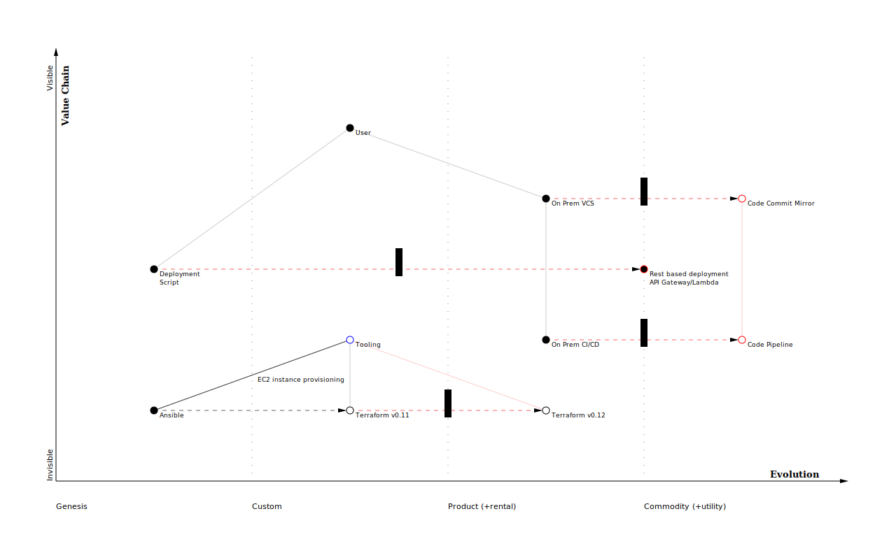

= Go-Wardley - Wardley maps generator
David Gamba, https://github.com/DavidGamba
:idprefix:
:toc: macro

Wardley Maps Generator written in Golang.
The generator takes an HCL based map description and generates a map in SVG format.
If viewed on a browser, the SVG will have hover over functionality to get additional details on node descriptions.

toc::[]

== Usage

----
$ ./go-wardley -f examples/map.hcl
Updated file: examples/map.svg

$ ./go-wardley -f examples/map.hcl -o examples/map.svg
Updated file: examples/map.svg

# Watch for file changes and update the file automatically.
$ ./go-wardley -f examples/map.hcl --watch
Starting watcher on: examples
Updated file: examples/map.svg
Updated file: examples/map.svg

# Serve the file on a webserver in localhost:8080 by default
# Update the drawing by refreshing the page.
$ ./go-wardley -f examples/map.hcl --serve
Serving content on: http://localhost:8080
$ ./go-wardley -f examples/map.hcl --serve 6060
Serving content on: http://localhost:6060
----

== Element types

=== Size

----
size {
	width     = 1280
	height    = 768
	margin    = 40
	font_size = 9
}
----

=== Node

----
node user {
	label       = "User"        # Required
	visibility  = 1             # Required
	evolution   = "custom"      # Required
	x           = 1             # Required
	description = "Description"
	fill        = "black"
	color       = "black"
}
----

`evolution`:: `genesis`, `custom`, `product` or `commodity`.

=== Connector

----
connector {
	from  = "user"        # Required
	to    = "vcs"         # Required
	label = "Description"
	color = "black"
	type  = "normal"
}
----

`type`:: `normal`, `bold`, `change` or `change-inertia`.

== Example input

A more extensive example can be found in link:./examples/map.hcl[].

[source, hcl]
----
# Anchor
node user {
	label       = "User"
	visibility  = 1
	evolution   = "custom"
	x           = 1
	description = "User Description"
	fill        = "black"
}

node vcs {
	label       = "On Prem VCS"
	visibility  = node.user.visibility + 1
	evolution   = "product"
	x           = 1
	description = "On prem VCS"
	fill        = "black"
}

node code_commit {
	label       = "Code Commit Mirror"
	visibility  = node.vcs.visibility
	evolution   = "commodity"
	x           = 1
	description = "Allows Code Pipeline to access the code."
	color       = "red"
}

connector {
	from = "user"
	to   = "vcs"
}

connector {
	from = "vcs"
	to   = "code_commit"
	color = "red"
	type = "change-inertia"
}
----

== Roadmap

* Make the node label optional, read the node ID if not present and title case it (configurable?).

* Add an optional leyend box indicating the types of elements used in the map.

* Better looks overall. Cleaner code.

* Allow specifying node, connector and grid font sizes independently.

* Arch type connector.

== License

This file is part of go-wardley.

Copyright (C) 2019-2020  David Gamba Rios

This Source Code Form is subject to the terms of the Mozilla Public
License, v. 2.0. If a copy of the MPL was not distributed with this
file, You can obtain one at http://mozilla.org/MPL/2.0/.
